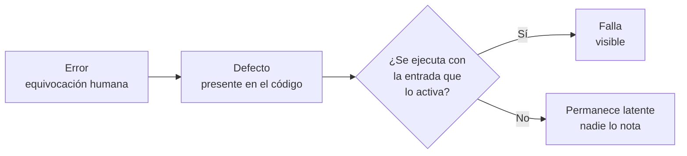

# Clase 01 - Semana 01 - ¿Cómo sabes que funciona? Calidad, testing y el oficio de demostrar que el código sirve

- **Unidad:** 01 · Calidad y Testing de Software
- **Fecha:** Lunes 10 de agosto de 2026
- **Duración:** 3 horas pedagógicas · 140 minutos (08:30 - 10:50)
- **Modalidad:** Presencial en Laboratorio PC
- **Docente:** Diego Obando

---

# Objetivos de la Clase

## Objetivo General

Al finalizar esta sesión, el estudiante será capaz de distinguir entre la impresión de que un programa funciona y la evidencia de que efectivamente funciona, reconociendo el testing como la disciplina profesional que produce esa evidencia. Comprenderá por qué esta distinción se volvió más crítica —y no menos— en un contexto donde buena parte del código se escribe con asistencia de agentes de IA, identificará el costo real que tienen los defectos cuando llegan a producción, y situará el recorrido completo del módulo: qué va a construir, cómo será evaluado y con qué herramientas va a trabajar durante las próximas ocho semanas.

## Objetivos Específicos

1. **Diferenciar "me funcionó" de "está probado"**, reconociendo que una verificación manual, ocasional y no repetible no constituye evidencia de calidad, y que la diferencia entre ambas afirmaciones es exactamente el objeto de estudio de este módulo.
2. **Explicar por qué el testing aumenta su valor cuando el código se genera con asistencia de IA**, comprendiendo que la velocidad de producción no garantiza corrección y que la capacidad de verificar es lo que permite aprovechar esa velocidad sin acumular defectos.
3. **Dimensionar el costo real de los defectos de software**, analizando casos documentados donde una falla no detectada produjo pérdidas económicas, daño a personas o destrucción de sistemas, y reconociendo que el costo de corregir crece a medida que el defecto avanza en el ciclo de vida.
4. **Reconocer la calidad de software como una propiedad medible y no como una opinión**, anticipando que existen estándares internacionales que definen contra qué se mide un producto y que serán trabajados durante la unidad.
5. **Situar el módulo dentro de su formación técnica**, identificando la unidad de competencia, las dos unidades de aprendizaje, el carácter incremental de las tres evaluaciones y el proyecto transversal que acompañará todas las sesiones.
6. **Identificar el stack de trabajo del módulo** y comprender el criterio detrás de su elección: Python con tipado estricto y análisis estático como columna vertebral, TypeScript en la capa de interfaz, e integración continua como destino final del trabajo.
7. **Reconocer su propio punto de partida** mediante el diagnóstico inicial, identificando con honestidad qué domina y qué desconoce sobre pruebas, tipado, control de versiones y automatización, para poder medir su avance al cierre del módulo.

## Competencias Transversales

- **Criterio profesional:** comprender que entregar software que funciona no es lo mismo que entregar software confiable, y que la diferencia entre ambos es responsabilidad de quien desarrolla, no del usuario que lo descubre fallando.
- **Ética y responsabilidad:** reconocer que detrás de un defecto de software puede haber consecuencias reales sobre personas, dinero y confianza, y que omitir una verificación por comodidad o por apuro es una decisión con efectos, no un detalle técnico menor.
- **Pensamiento crítico frente a la automatización:** evaluar el resultado de una herramienta o de un agente en lugar de aceptarlo por su apariencia de corrección, entendiendo que el código plausible y el código correcto no son la misma cosa.
- **Comunicación técnica:** describir un defecto, una prueba o un hallazgo con precisión suficiente para que otra persona pueda reproducirlo, en lugar de recurrir a descripciones vagas como "no funciona" o "se cae".
- **Trabajo agentic supervisado:** usar agentes de IA para producir y explorar código manteniendo la verificación y el juicio técnico del lado humano, que es precisamente la competencia que este módulo entrena.

---

# Mapa de la Clase

| Horario | Sección | Propósito |
|---------|---------|-----------|
| 08:30 - 08:45 | Presentación y encuadre | Presentación del docente y del módulo, y la pregunta que abre el curso: ¿cómo sabes que tu código funciona? |
| 08:45 - 09:10 | Bloque 1 | Experimento de apertura: sometemos a prueba una función recién escrita y revisamos qué aparece. |
| 09:10 - 09:40 | Bloque 2 | Qué significa calidad de software y qué cuesta no tenerla. Casos reales de defectos con consecuencias documentadas y la curva de costo de corregir. |
| 09:40 - 09:50 | Pausa | Descanso técnico. |
| 09:50 - 10:20 | Bloque 3 | El mapa del módulo: unidades, proyecto transversal, las tres evaluaciones incrementales, el stack de trabajo y las reglas del juego con IA. |
| 10:20 - 10:40 | Bloque 4 | Diagnóstico individual de conocimientos previos y revisión de las respuestas en plenario. |
| 10:40 - 10:50 | Cierre | Síntesis de la sesión y preparación de la clase del martes. |

---

# BLOQUE 1: ¿Qué significa que un programa funcione?

- **Duración:** 25 minutos
- **Objetivo del bloque:** instalar la distinción entre *parecer correcto* y *ser correcto*, reconociendo que la verificación ocasional y manual no constituye evidencia de calidad. Al final del bloque, el estudiante debe poder explicar por qué un programa puede estar equivocado sin fallar nunca delante de quien lo escribió, y distinguir error, defecto y falla como tres cosas distintas.
- **Modalidad:** Expositiva y conversada, con ejecución en vivo del código en pantalla.

## Desarrollo

### 1.1 La pregunta que abre el módulo

Cuando alguien termina de programar algo y se le pregunta si funciona, la respuesta habitual es una
variante de esta:

> "Sí, lo probé y anduvo."

Esa frase es, en la práctica, el estándar de calidad más usado de la industria. Y es un estándar
débil, por una razón simple: describe **una experiencia**, no una **propiedad del programa**.

"Lo probé y anduvo" significa que una persona ejecutó el código una vez, con unos datos concretos,
en un computador concreto, y observó algo que le pareció correcto. Nada de eso garantiza que el
programa se comporte bien con otros datos, mañana, en otra máquina o después del próximo cambio.

Durante este módulo vamos a reemplazar esa frase por otra, mucho más exigente:

> "Funciona, y puedo demostrarlo."

La diferencia entre ambas afirmaciones es todo el contenido del curso.

### 1.2 Un caso concreto: la función que calcula la nota final

Veamos una función que cualquiera de nosotros habría escrito, o aprobado en una revisión de código.
Calcula la nota final de un estudiante como el promedio de sus notas parciales:

```python
def nota_final(notas: list[float]) -> float:
    """Calcula la nota final como el promedio de las notas parciales."""
    promedio = sum(notas) / len(notas)
    return round(promedio, 1)
```

Es código limpio. Tiene tipos declarados, tiene documentación, hace una sola cosa y la hace de la
forma más directa posible. Si la probamos, además, funciona:

```python
>>> nota_final([6.0, 5.5, 6.5])
6.0
```

Ahora consideremos dos estudiantes. Ambos tienen, en el papel, un promedio de **3.95**. En la escala
chilena, la nota mínima de aprobación es 4.0, así que ese 3.95 debería redondearse a 4.0 y ambos
deberían aprobar.

Esto es lo que ocurre en realidad:

```python
>>> round(3.95, 1)          # el 3.95 escrito directamente
4.0                          # aprueba

>>> nota_final([3.8, 4.1, 3.95])   # el 3.95 obtenido como promedio
3.9                          # reprueba
```

El mismo número produce dos destinos distintos. Uno aprueba el módulo y el otro lo reprueba, y la
diferencia no está en las notas del estudiante: está en si el 3.95 fue **escrito** o **calculado**.

La explicación es que los computadores no guardan los decimales de forma exacta. Ninguno de los dos
valores es realmente 3.95:

| Origen del valor | Lo que guarda el computador | Resultado |
| --- | --- | --- |
| `3.95` escrito directamente | `3.95000000000000017763...` | Queda por encima de 3.95, sube a `4.0` |
| Promedio de `3.8`, `4.1` y `3.95` | `3.9499999999999997` | Queda por debajo, baja a `3.9` |

Hay una segunda sorpresa escondida en la misma función. El redondeo de Python no funciona como el
que nos enseñaron en el colegio:

```python
>>> round(4.5)
4                            # esperábamos 5
>>> round(5.5)
6                            # y aquí sí subió
```

Python aplica **redondeo bancario**: cuando el valor cae exactamente en la mitad, lo aproxima al
número par más cercano, en lugar de subir siempre. Es una convención legítima y ampliamente usada
—reduce el sesgo acumulado en cálculos estadísticos y financieros— pero no es la que espera un
docente calculando notas.

Conviene subrayar lo que acaba de pasar:

> El código no tiene errores de sintaxis, no tiene fallos de lógica evidentes, está bien escrito y
> pasa la revisión visual de cualquier programador. Y aun así reprueba a un estudiante que debía
> aprobar.

### 1.3 Error, defecto y falla: tres palabras que no son sinónimos

En el lenguaje cotidiano decimos "un bug" para todo. En testing profesional se distinguen tres
cosas, y la distinción importa porque explica exactamente lo que vimos recién:

- **Error:** la equivocación humana. Aquí fue asumir que `round()` redondea como en el colegio y que
  los decimales se guardan de forma exacta.
- **Defecto:** la consecuencia de ese error dentro del código. Es la línea `return round(promedio, 1)`,
  que está ahí, escrita, esperando.
- **Falla:** la manifestación visible del defecto durante la ejecución. Es el `3.9` que aparece en
  pantalla y reprueba a alguien.

La relación entre los tres no es automática:



Este diagrama contiene la idea central del bloque: **un defecto solo se convierte en falla si el
programa recibe la entrada precisa que lo activa.** Con las notas `[6.0, 5.5, 6.5]` el defecto
estaba igual de presente, pero nadie lo vio.

Por eso existe una consecuencia incómoda que conviene aceptar temprano: que un programa no haya
fallado **no significa que no tenga defectos**. Solo significa que todavía no recibió la entrada
correcta para revelarlos.

### 1.4 Por qué "lo probé y funcionó" no es evidencia

Con lo anterior podemos ser precisos sobre por qué la verificación manual y ocasional es
insuficiente. Tiene cuatro debilidades concretas:

- **Está sesgada al camino feliz.** Probamos con los datos que teníamos en mente al programar, que
  son justamente los que el código maneja bien. Nadie prueba espontáneamente con un promedio que caiga
  exactamente en la frontera de aprobación.
- **No es repetible.** Si mañana alguien pregunta qué se probó, la respuesta es un recuerdo. No hay
  registro, no hay forma de repetir el mismo ejercicio ni de comparar con la versión anterior.
- **No escala.** Una función se puede revisar a mano. Un sistema con doscientas funciones que se
  modifican todas las semanas, no.
- **Se degrada con el tiempo.** Aunque hoy la prueba manual haya sido exhaustiva, mañana alguien
  cambia una línea y nadie vuelve a ejecutar todo desde cero.

La alternativa que vamos a construir durante el módulo invierte esas cuatro propiedades: pruebas
**escritas como código**, que se ejecutan solas, siempre igual, todas las veces que haga falta y
sobre todo el sistema.

### 1.5 Qué cambia cuando el código lo escribe un agente

Todo lo anterior era cierto antes de que existieran los asistentes de IA. Lo que cambió es la
**escala**.

Un agente produce código correcto en apariencia mucho más rápido de lo que una persona puede
revisarlo. Y la característica del código generado por un modelo es precisamente que es
**plausible**: sigue las convenciones, usa las funciones estándar de la biblioteca, incluye tipos y
documentación. La función `nota_final` de este bloque es exactamente el tipo de código que produce un
agente, y su defecto no viene de que el modelo sea torpe: `round()` es la función correcta que
cualquiera usaría.

De ahí se sigue el desplazamiento que da sentido a este módulo:

> Cuando escribir código deja de ser el cuello de botella, el cuello de botella pasa a ser
> **verificarlo**. La habilidad escasa ya no es producir, es demostrar que lo producido sirve.

Esto no es un argumento en contra de usar agentes. En este módulo los vamos a usar, y bastante. Es
un argumento sobre dónde queda el trabajo humano: en definir qué debe cumplirse, en diseñar los
casos que lo pondrían a prueba y en decidir si la evidencia alcanza.

### Preguntas guía

- ¿Qué diferencia hay entre decir "lo probé y funcionó" y decir "funciona y puedo demostrarlo"?
- Si un programa nunca ha fallado, ¿podemos concluir que no tiene defectos? ¿Por qué?
- ¿Por qué el mismo valor 3.95 produjo dos resultados distintos según cómo se obtuvo?
- ¿Cuál fue el error humano detrás del defecto de la función `nota_final`?
- ¿Qué hace que el código generado por un agente sea especialmente difícil de revisar a simple vista?
- ¿Qué tipo de entrada habría que haber probado para descubrir este defecto antes de usarlo?

### Cierre del bloque

- **Idea clave:** un programa puede estar equivocado sin fallar nunca delante de quien lo escribió.
  Que parezca correcto, que esté bien escrito y que haya funcionado en las pruebas informales no es
  evidencia de que sea correcto.
- **Puente:** si "funciona" no puede seguir significando "me anduvo", entonces necesitamos una
  definición de calidad que no dependa de la impresión de cada persona. En el siguiente bloque vamos a
  ver qué significa calidad de software cuando se mide contra un estándar, y cuánto cuesta realmente
  no medirla.

---

# BLOQUE 2: Calidad medible y el costo de no medirla

- **Duración:** 30 minutos
- **Objetivo del bloque:** comprender la calidad de software como un conjunto de características definidas y medibles contra un estándar internacional, en lugar de una apreciación personal. Al final del bloque, el estudiante debe poder nombrar las características de calidad de la norma ISO/IEC 25010, reconocer que un producto puede ser excelente en unas y pésimo en otras, y explicar por qué el costo de corregir un defecto aumenta a medida que avanza el ciclo de vida.
- **Modalidad:** Expositiva y conversada, con análisis de casos documentados.

## Desarrollo

### 2.1 Si "funciona" no basta, ¿qué medimos exactamente?

En el bloque anterior quedó claro que "funciona" es una afirmación demasiado vaga para sostener una
decisión profesional. Pero decir que algo tiene "calidad" es igual de vago si no especificamos
**calidad en qué**.

Pensemos en un caso cotidiano. Una aplicación de banco puede:

- calcular todos los montos correctamente, pero demorar quince segundos en abrir;
- ser rapidísima, pero exponer los datos de los clientes;
- ser rápida y segura, pero imposible de usar para una persona mayor;
- ser rápida, segura y usable, pero tan enredada por dentro que nadie se atreve a modificarla.

Las cuatro versiones "funcionan". Ninguna es de buena calidad, y cada una falla en una dimensión
distinta. Por eso la pregunta útil no es *"¿este software es bueno?"* sino *"¿bueno respecto de
qué?"*.

Esa es exactamente la función de un estándar de calidad: **poner nombre a las dimensiones**, para
que la conversación deje de depender de la impresión de cada persona y se pueda medir, comparar y
exigir.

### 2.2 ISO/IEC 25010: la calidad como conjunto de características

La norma internacional que define la calidad de un producto de software es la **ISO/IEC 25010**,
parte de la familia SQuaRE. No dice si un software es bueno: descompone la calidad en
características, y deja que cada proyecto decida cuáles le importan y cuánto.

En su revisión vigente, la norma define nueve características de calidad del producto:

| Característica | Pregunta que responde |
| --- | --- |
| **Adecuación funcional** | ¿Hace lo que se supone que debe hacer, de forma correcta y completa? |
| **Eficiencia de desempeño** | ¿Responde en un tiempo razonable y usa bien los recursos? |
| **Compatibilidad** | ¿Convive e intercambia información con otros sistemas? |
| **Capacidad de interacción** | ¿Las personas pueden usarlo de forma efectiva y sin frustrarse? |
| **Fiabilidad** | ¿Se mantiene disponible y se recupera cuando algo falla? |
| **Seguridad** | ¿Protege la información y controla quién accede a qué? |
| **Mantenibilidad** | ¿Se puede modificar sin romperlo y sin sufrir? |
| **Flexibilidad** | ¿Se adapta a nuevos entornos, contextos y necesidades? |
| **Inocuidad** | ¿Evita provocar daño a las personas o al entorno? |

Una advertencia útil apenas empiecen a buscar por su cuenta: **van a encontrar versiones con ocho
características**, donde aparecen "usabilidad" y "portabilidad" en vez de "capacidad de interacción"
y "flexibilidad", y sin "inocuidad". Esa es la edición anterior de la misma norma. No está mal, está
desactualizada, y saber distinguirlo es parte de trabajar con estándares: **los estándares también
tienen versiones**, y citar uno sin decir cuál es una imprecisión.

Dos ideas que conviene retener de este modelo:

- La calidad **no es un número único**. Un producto tiene un perfil: alto en unas características,
  bajo en otras. Un videojuego y un marcapasos no priorizan lo mismo.
- Las características **se negocian**. Subir seguridad suele costar desempeño; subir flexibilidad
  suele costar simplicidad. Elegir es parte del trabajo profesional, y elegir sin saber que estás
  eligiendo es como se llega a los desastres de la sección siguiente.

### 2.3 Cuando nadie mide: tres casos documentados

Estos tres casos son conocidos, están investigados y cada uno enseña algo distinto.

**Therac-25 (1985–1987).** Máquina de radioterapia. Un defecto de concurrencia permitía que, si el
operador corregía muy rápido un dato en la pantalla, el equipo aplicara una dosis de radiación
cientos de veces superior a la indicada. Hubo al menos seis accidentes graves y varias muertes.

El detalle que más importa para nosotros: **el defecto ya existía en los modelos anteriores**. En
esas máquinas había trabas mecánicas que impedían físicamente la sobredosis, así que el defecto
nunca se manifestaba. Al confiar el control únicamente al software y quitar esas trabas, el defecto
latente se convirtió en falla mortal. Es exactamente el diagrama del bloque anterior, con
consecuencias reales.

**Ariane 5, vuelo 501 (1996).** El cohete se destruyó 39 segundos después del despegue. La causa fue
la conversión de un número decimal de 64 bits a un entero de 16 bits, que se desbordó porque el
Ariane 5 volaba con una velocidad horizontal mayor que su antecesor.

Lo notable: **ese código era correcto**. Funcionaba perfecto en el Ariane 4, de donde se reutilizó
sin volver a probarlo en el contexto nuevo. Además, el cálculo que provocó el desborde ni siquiera
era necesario después del despegue. La pérdida se estimó en cientos de millones de dólares. La
lección es que la corrección no es una propiedad absoluta del código: **es relativa a un contexto y
a unos supuestos**, y cuando el contexto cambia hay que volver a verificar.

**Knight Capital (2012).** Una firma financiera desplegó código nuevo en sus servidores, pero la
actualización no llegó a uno de ellos. En ese servidor quedó activo código antiguo que llevaba años
sin usarse y que un indicador reutilizado volvió a despertar. En unos 45 minutos la empresa perdió
alrededor de 440 millones de dólares y dejó de ser viable.

Acá no hubo un cálculo mal hecho: hubo **un proceso sin verificación automática**. Nadie comprobó que
el despliegue hubiera quedado igual en todas las máquinas, y no existía una prueba que detectara que
un comportamiento viejo había vuelto a la vida. Ese tipo de prueba tiene nombre —**pruebas de
regresión**— y es uno de los temas centrales de este módulo.

### 2.4 El costo de encontrar un defecto tarde

Los tres casos comparten algo: el defecto se descubrió en el peor momento posible. Eso no es
casualidad, y responde a un patrón bien conocido en ingeniería de software.

Un mismo defecto cuesta muy distinto según cuándo se detecta:

| Momento de la detección | Qué implica corregirlo |
| --- | --- |
| Mientras se escribe el código | Cambiar una línea. Minutos. |
| Al ejecutar las pruebas automatizadas | Volver sobre algo escrito hoy, con el contexto fresco. |
| En revisión o integración | Coordinar con otras personas, rehacer partes ya aceptadas. |
| Después de publicar | Diagnosticar en caliente, corregir, volver a desplegar, reparar datos dañados, responder a usuarios. |

Es habitual citar multiplicadores concretos para esta escalada —del orden de diez o cien veces por
etapa—. Conviene tomar esas cifras con cuidado: **la tendencia está bien establecida, pero los
números exactos provienen de estudios antiguos y han sido cuestionados** por su metodología. Lo que
sí se sostiene, y basta para decidir, es la dirección: mientras más tarde se detecta un defecto, más
caro sale, y el salto más grande ocurre al cruzar hacia producción, donde aparecen costos que no son
técnicos —clientes afectados, reputación, responsabilidad legal—.

De ahí se desprende el principio que ordena todo el módulo:

> No probamos para encontrar defectos. Probamos para encontrarlos **temprano**.

### 2.5 Qué parte de la calidad puede observar el testing

Conviene cerrar con una precisión honesta: el testing no mide todas las características de la norma
con la misma facilidad.

- Hay características que se observan de forma bastante directa con pruebas: adecuación funcional,
  fiabilidad, eficiencia de desempeño, seguridad.
- Hay otras que se evalúan sobre todo con revisión, métricas de código y juicio experto:
  mantenibilidad y flexibilidad.
- Y hay una que exige observar personas reales usando el producto: la capacidad de interacción.

Por eso durante el módulo no vamos a trabajar un solo tipo de prueba. Vamos a construir un
repertorio: pruebas que ejecutan código, revisiones que lo leen sin ejecutarlo, mediciones de
desempeño y observación de uso. Cada característica de calidad exige su propio tipo de evidencia.

### Preguntas guía

- ¿Por qué preguntar "¿este software es bueno?" es una pregunta mal formulada?
- ¿Puede un producto ser de alta calidad en una característica y de muy baja en otra? Da un ejemplo.
- En el caso Therac-25, ¿en qué momento apareció el defecto y en qué momento apareció la falla?
- ¿Por qué el código del Ariane 5 puede considerarse correcto y provocar igual una catástrofe?
- ¿Qué tipo de prueba habría evitado la pérdida de Knight Capital?
- ¿Por qué conviene desconfiar de las cifras exactas sobre el costo de corregir defectos, y qué parte
  de esa idea sí es sólida?
- De las nueve características de la norma, ¿cuáles crees que importan más en una aplicación que
  usas todos los días? ¿Y en una que maneje dinero o salud?

### Cierre del bloque

- **Idea clave:** la calidad de software no es una opinión ni un número único: es un conjunto de
  características definidas por un estándar, que se negocian entre sí y que exigen tipos distintos
  de evidencia. Y el costo de ignorarlas crece a medida que el defecto avanza hacia producción.
- **Puente:** ya sabemos qué vamos a medir y por qué importa hacerlo temprano. En el siguiente bloque
  vemos cómo se traduce eso en este módulo concreto: qué vamos a construir durante las ocho semanas,
  con qué herramientas, cómo se evalúa y bajo qué reglas usamos agentes de IA.

---

# BLOQUE 3: El mapa del módulo

- **Duración:** 30 minutos
- **Objetivo del bloque:** comprender el recorrido completo del módulo y el criterio que lo ordena, reconociendo qué se va a construir, con qué herramientas, cómo se evalúa y bajo qué reglas se permite el uso de agentes de IA. Al final del bloque, el estudiante debe poder explicar por qué el módulo termina con un proyecto propio con pruebas automatizadas y no con una prueba escrita.
- **Modalidad:** Expositiva y conversada, con revisión del cronograma y resolución de dudas.

## Desarrollo

### 3.1 Lo que vas a tener el 30 de septiembre

Empecemos por el final. Al terminar el módulo, cada uno de ustedes va a tener un repositorio propio
con:

- **tipado estricto y análisis estático** configurados y sin advertencias;
- una **suite de pruebas automatizadas** con pruebas unitarias, de integración y de extremo a extremo;
- un **plan de pruebas** que explica qué se prueba, por qué y con qué criterio;
- **pruebas no funcionales** de desempeño y seguridad;
- y un **pipeline de integración continua** que ejecuta todo eso solo, cada vez que alguien toca el
  código.

Eso no es material de curso: es una pieza de portafolio. La mayoría de quienes postulan a su primer
trabajo muestran aplicaciones que se ven bien. Muy pocos pueden mostrar un proyecto donde se
demuestre que funciona. Esa diferencia es visible de inmediato para cualquiera que revise
técnicamente su trabajo, porque es la que separa a alguien que programa de alguien con quien se puede
trabajar en equipo.

### 3.2 El recorrido: dos unidades, ocho semanas

El módulo se organiza en dos unidades que responden dos preguntas distintas.

**Unidad 1 — ¿Qué significa que funcione?** Construye el criterio: qué es la calidad, cómo se
verifica sin ejecutar el código y contra qué estándares se compara.

**Unidad 2 — Demuéstralo.** Construye la evidencia: cómo se diseñan los casos, cómo se escriben las
pruebas, cómo se automatiza su ejecución.

| Semana | Foco |
| --- | --- |
| 1 · 10 al 12 de agosto | Qué significa que un programa funcione. Entorno de trabajo y primera prueba |
| 2 · 17 al 19 de agosto | Verificación, validación y evidencia. Ciclo de vida del producto |
| 3 · 24 al 26 de agosto | Pruebas estáticas: tipado, análisis y revisión de código. Estándares |
| 4 · 31 de agosto al 2 de septiembre | Auditoría de calidad · **Evaluación 1** · Diseño de casos de prueba |
| 5 · 7 al 9 de septiembre | De los casos al código: cobertura y desarrollo guiado por pruebas |
| 6 · 14 al 16 de septiembre | Integración, extremo a extremo y plan de pruebas |
| 7 · 21 al 23 de septiembre | **Evaluación 2** · Integración continua y pruebas no funcionales |
| 8 · 28 al 30 de septiembre | Cierre del proyecto · **Evaluación final** |

El orden no es arbitrario. Primero aprendemos a **mirar** un sistema y juzgarlo, después a
**construir** la evidencia de que funciona. Al revés se puede escribir muchas pruebas sin saber si
prueban algo que importa.

### 3.3 Un proyecto propio, tres entregas

Las tres evaluaciones no son tres trabajos distintos: son **tres versiones del mismo proyecto**, cada
vez más confiable.

Las tres pautas se entregan al inicio del módulo y avanzas a tu propio ritmo: ninguna se rinde en
clase. Lo que está fijado es la fecha de corte en que envías tu avance.

| Entrega | Fecha de corte | Qué se envía |
| --- | --- | --- |
| **Evaluación 1** | Lunes 21 de septiembre | Tu proyecto con su línea base de calidad: tipado estricto, análisis estático sin advertencias, primeras pruebas y los hallazgos de tu propia auditoría |
| **Evaluación 2** | Viernes 25 de septiembre | El mismo proyecto con su plan de pruebas y su suite automatizada funcionando |
| **Evaluación final** | Miércoles 30 de septiembre | El mismo proyecto con integración continua, pruebas de regresión y no funcionales, con su pipeline en verde |

Trabajar sobre un proyecto único durante ocho semanas tiene una razón pedagógica: **el testing solo
se entiende cuando el sistema crece**. Escribir una prueba aislada es un ejercicio; ver esa misma
prueba avisarte de que rompiste algo tres semanas después es la experiencia que enseña para qué
sirve.

No hace falta traer nada preparado. **El proyecto nace en la primera evaluación**, con lo que vamos a
ver en las tres primeras semanas. Puede ser una idea nueva o la continuación de algo que ya hayan
construido; esa decisión es de cada uno.

Lo que sí conviene tener claro desde ahora, porque cambia el criterio para elegirlo: **acá no se
evalúa la aplicación sino la calidad de la verificación construida sobre ella**. Ustedes ya saben
levantar un sistema que funcione —lo han hecho—. Lo que este módulo agrega es lo otro: poder
demostrarlo.

Por eso conviene acotar el alcance. Un sistema con tres reglas de negocio bien interrogadas enseña
más, y evalúa mejor, que uno con veinte funcionalidades sin evidencia de ninguna. No es bajar la
ambición: es moverla de la cantidad de código a la profundidad de la prueba, que es exactamente el
salto profesional que sigue después de saber construir.

### 3.4 Las herramientas, y por qué estas

El módulo trabaja con dos lenguajes. **Python** es la columna vertebral, y **TypeScript** aparece en
la capa de interfaz. No son dos cursos paralelos: es la forma que tiene un sistema real, con un
backend y una interfaz que lo consume.

Cada herramienta cubre un tipo distinto de evidencia, y se conecta con las características de calidad
que vimos en el bloque anterior:

| Herramienta | Qué aporta | Característica de calidad |
| --- | --- | --- |
| `uv` | Entorno reproducible: el mismo proyecto se instala igual en cualquier máquina | Flexibilidad |
| `ruff` | Análisis estático: detecta problemas sin ejecutar el código | Mantenibilidad |
| `pyrefly` | Verificación de tipos: errores de contrato antes de correr nada | Adecuación funcional |
| `pytest` | Pruebas automatizadas en Python | Adecuación funcional, fiabilidad |
| FastAPI | El servicio sobre el que se prueba la integración | — |
| Vitest | Pruebas automatizadas en TypeScript | Adecuación funcional |
| Playwright | Pruebas de extremo a extremo simulando a una persona usando el sistema | Capacidad de interacción |
| GitHub Actions | Ejecuta todas las pruebas solo, ante cada cambio | Fiabilidad |

Ninguna de estas herramientas es un capricho: son las que se usan hoy en la industria, y son las que
hacen posible programar rápido sin acumular defectos. Si mañana cambia el nombre de alguna, el
criterio detrás sigue siendo el mismo, y ese criterio es lo que van a llevarse del módulo.

### 3.5 Las reglas del juego con agentes de IA

En este módulo **se permite y se espera** que usen agentes de IA. No hay ninguna ventaja pedagógica
en prohibir la herramienta con la que van a trabajar el resto de su vida profesional.

Pero conviene entender por qué la regla acá es distinta a la de otros módulos. En un módulo de
programación, el producto es el código, y delegarlo al agente al menos deja algo funcionando. En este
módulo el producto es **la verificación**: la evidencia de que ese código sirve. Si delegas la
verificación sin entenderla, no te queda nada, porque lo único que estabas construyendo era
justamente tu criterio.

De ahí salen tres reglas concretas:

1. **Puedes usar agentes para escribir pruebas**, y de hecho es una buena idea. Pero tienes que poder
   explicar **por qué existe cada prueba** y qué pasaría si la borraras. Una prueba que no sabes
   justificar es ruido, aunque esté en verde.
2. **Debes documentar qué delegaste y qué revisaste.** Cada entrega incluye una sección donde
   explicas qué hizo el agente, qué corregiste y qué decidiste tú.
3. **Respondes por lo que entregas.** Si el agente escribió algo que no entiendes y falla, el
   problema es tuyo, no del modelo.

Hay además una forma de trabajo que vamos a practicar en la semana 3 y que invierte la relación
habitual: **la revisión adversarial entre modelos**. Un agente escribe el código, otro agente
distinto lo audita buscando fallas, y ustedes arbitran quién tiene razón. Es una técnica real de
verificación, y además entrena exactamente la habilidad que este módulo persigue: leer código ajeno
con desconfianza productiva.

### Preguntas guía

- ¿Por qué el módulo termina con un proyecto con pruebas y no con una prueba escrita?
- ¿Qué ventaja tiene trabajar ocho semanas sobre un mismo proyecto en vez de hacer trabajos sueltos?
- ¿Por qué se aprende primero a juzgar un sistema y después a escribir pruebas, y no al revés?
- Si en este módulo se permite usar agentes, ¿qué es exactamente lo que se está evaluando?
- ¿Qué significa que "una prueba que no sabes justificar es ruido, aunque esté en verde"?
- Mirando la tabla de herramientas, ¿qué característica de calidad crees que va a costar más
  demostrar en tu proyecto?

### Cierre del bloque

- **Idea clave:** el módulo construye una sola cosa a lo largo de ocho semanas —la capacidad de
  demostrar que un sistema funciona— y la construye sobre un proyecto propio, con las herramientas
  que se usan hoy en la industria. Los agentes son parte del trabajo, pero el criterio para juzgar su
  resultado no se delega.
- **Puente:** antes de empezar a construir ese criterio hace falta saber desde dónde parte cada uno.
  Eso es lo que hacemos en el último bloque de esta sesión.

---

# BLOQUE 4: Línea base — de dónde partimos

- **Duración:** 20 minutos
- **Objetivo del bloque:** establecer el punto de partida individual de cada estudiante mediante un diagnóstico sin calificación, comprendiendo de paso por qué toda medición confiable exige honestidad en los datos. Al final del bloque, el estudiante debe poder explicar qué es una línea base y por qué una medición falseada es peor que no medir.
- **Modalidad:** Trabajo individual escrito, con revisión colectiva de los resultados.

## Desarrollo

### 4.1 Medir antes de cambiar

Antes de modificar un sistema que ya existe, la práctica profesional dice que hay que registrar
**cómo se comporta ahora**. Ese registro se llama **línea base**, y sirve para responder después una
pregunta que de otro modo es imposible: cuando algo cambie, ¿mejoró, empeoró o quedó igual?

Sin línea base, cualquier afirmación sobre una mejora es una opinión. "Ahora está más rápido" no
significa nada si nadie midió cuánto demoraba antes. Es el mismo problema del "lo probé y anduvo" del
primer bloque, aplicado al tiempo.

El cuestionario de diagnóstico es exactamente esa operación, aplicada a ustedes: registra qué saben
hoy sobre pruebas, tipado, control de versiones y automatización. En la última semana del módulo
vamos a repetir el mismo instrumento, y la comparación entre ambos va a ser la evidencia más concreta
que tengan de lo que aprendieron.

Quienes ya lo respondieron, lo entregan. Quienes no, lo completan ahora. En ambos casos, lo
importante es que las respuestas reflejen lo que sabían **antes** de esta sesión: ese es el único
dato que sirve como punto de partida.

Conviene notar que esto no es una metáfora: es el mismo procedimiento que van a aplicarle a su
proyecto en la Evaluación 1, cuando registren su estado de calidad inicial antes de empezar a
mejorarlo.

### 4.2 Por qué "no sé" es la respuesta más valiosa

El cuestionario no lleva nota, y eso cambia por completo la estrategia óptima para responderlo.

En una prueba calificada conviene arriesgar: una respuesta al azar puede sumar y nunca resta. En un
diagnóstico ocurre lo contrario. Si alguien adivina y acierta, el instrumento registra un
conocimiento que no existe, y la consecuencia recae sobre quien respondió: se pasa rápido por un
contenido que necesitaba.

Dicho en el vocabulario que vamos a usar todo el módulo, adivinar produce el equivalente a **una
prueba que queda en verde aunque el sistema esté malo**. La medición dice que todo está bien, la
realidad dice otra cosa, y por confiar en esa medición se toman decisiones equivocadas. Un resultado
así es peor que no haber medido, porque además da confianza.

Por eso el cuestionario incluye explícitamente la opción **"no sé"**, y responder eso no tiene ningún
costo. Es información de la mejor calidad: dice la verdad.

### 4.3 Qué se registra

El instrumento tiene cuatro partes, y cada una mide algo distinto:

- **Punto de partida.** Lenguajes, manejo de Git y de la terminal, experiencia previa escribiendo
  pruebas y uso de agentes de IA. No hay respuestas correctas.
- **Verdadero o falso.** Diez afirmaciones sobre calidad y pruebas. Varias parecen evidentes y no lo
  son; las que generen más desacuerdo indican por dónde conviene empezar.
- **Respuesta breve.** Cuatro situaciones prácticas. Interesa el razonamiento, no la terminología: no
  hace falta conocer el nombre técnico de nada para responder bien.
- **Organización del módulo.** Con qué proyecto y con qué equipo va a trabajar cada uno.

### 4.4 Qué pasa con las respuestas

Los resultados se revisan **en esta misma sesión**, en conjunto y sin nombres. El objetivo no es
evaluar a nadie sino ver el mapa del grupo: dónde hay acuerdo, dónde hay confusión repartida y qué
conviene tratar primero.

Las afirmaciones que dividan a la sala son, casi siempre, las más interesantes. Un desacuerdo
generalizado no indica que la mitad del curso esté equivocada: indica que ahí hay una idea que parece
obvia desde dos lados opuestos, y esas son justamente las que producen defectos en el código.

### Preguntas guía

- ¿Qué es una línea base y para qué sirve?
- ¿Por qué "ahora funciona mejor" no es una afirmación válida sin una medición previa?
- ¿Por qué en un diagnóstico conviene responder "no sé" y en una prueba calificada no?
- ¿Qué tienen en común adivinar en este cuestionario y una prueba automatizada que pasa cuando no
  debería?
- ¿Qué relación tiene este ejercicio con lo que van a hacer sobre su propio proyecto en la primera
  evaluación?

### Cierre del bloque

- **Idea clave:** medir el estado inicial es la condición para poder afirmar después que algo mejoró.
  Y una medición solo sirve si los datos son honestos: un resultado falseado no es un dato incompleto,
  es un dato que engaña.

## Cierre de la clase

Esta primera sesión instaló una distinción que va a sostener las ocho semanas: **parecer correcto y
ser correcto no son lo mismo**.

Lo vimos en una función de doce líneas, bien escrita y bien documentada, que reprobaba a un
estudiante que debía aprobar. Vimos que el defecto estaba ahí incluso cuando el programa "funcionaba",
esperando la entrada que lo revelara. Vimos que la calidad no es una impresión sino un conjunto de
características definidas, negociables y medibles. Y vimos, en Therac-25, Ariane 5 y Knight Capital,
lo que cuesta descubrir eso demasiado tarde.

También quedó planteado el desplazamiento que le da sentido a este módulo en 2026. Escribir código
dejó de ser lo difícil. Un agente produce en minutos algo que se ve impecable, sigue las convenciones
y usa las funciones correctas. Lo escaso hoy es la capacidad de mirar ese resultado y decidir, con
fundamento, si sirve. Ese criterio no se descarga ni se delega: se construye probando, equivocándose y
volviendo a probar.

Por eso el módulo no termina con una prueba escrita sino con un proyecto propio corriendo su pipeline
en vivo. Al final de estas ocho semanas, la frase con la que empezamos hoy va a estar reemplazada:

> Ya no vamos a decir "lo probé y anduvo". Vamos a decir "funciona, y acá está la evidencia".

### Para la próxima sesión

El martes montamos el entorno de trabajo y escribimos la primera prueba automatizada. Para eso:

- **Trae tu computador**, si vas a trabajar en el tuyo.
- **Ten una cuenta de GitHub** creada y a mano.
- **Trae el diagnóstico respondido**, si alcanzaste a hacerlo.

Nada más. No hace falta instalar herramientas ni llegar con un proyecto pensado: las herramientas las
montamos juntos en clases —dejar el entorno funcionando y reproducible es parte del contenido— y el
proyecto lo van a construir más adelante, cuando ya tengan con qué juzgarlo.
